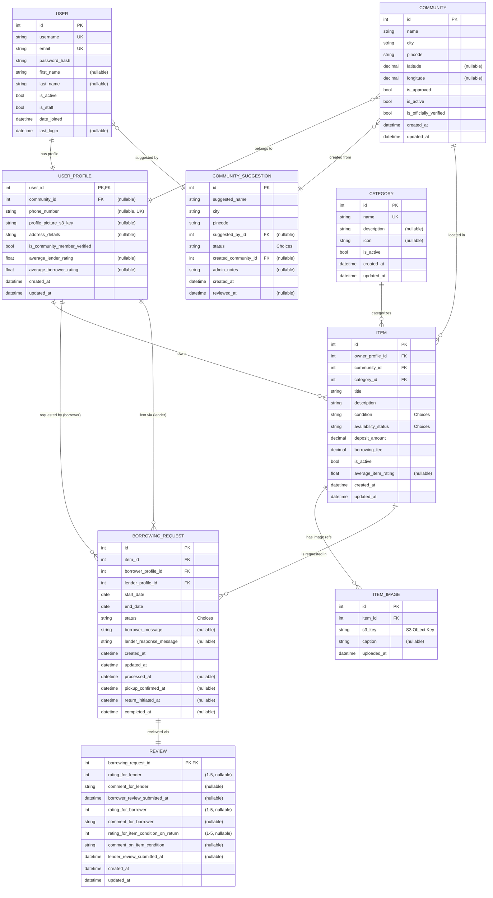

# Borrow Anything (Hyperlocal Backend) 🤝

This repository contains the backend API server for the **Borrow Anything** application, built with Django and Django REST Framework.

*(README generated: Sunday, March 30, 2025 at 4:40 AM IST, Bengaluru, Karnataka, India)*

## The Problem 🤔

In dense urban environments like Bengaluru, people often need everyday items temporarily (e.g., a specific kitchen utensil, extra chairs for a party, a travel bag for a short trip) but don't want to buy them for infrequent use. This leads to wasted money, resources, and storage space. While asking friends is possible, it's often inconvenient or relies on knowing who has what.

## The Solution: Hyperlocal Sharing ✨

**Borrow Anything** aims to create a trusted micro-sharing economy within specific, small geographical areas like apartment complexes or residential layouts. By leveraging the inherent trust and convenience of proximity, the platform connects neighbors to facilitate the borrowing and lending of everyday non-tool items.

This backend provides the API infrastructure to support the mobile application (built separately, likely in React Native).

## Database Schema (ER Diagram) 📈




### 🔄 Borrowing Flow

```ascii-animation
┌─────────────────┐     ┌─────────────────┐     ┌─────────────────┐
│    PENDING      │ ──> │     BOOKED      │ ──> │   PICKED UP     │
└─────────────────┘     └─────────────────┘     └─────────────────┘
        │                                               │
        │                                               │
        │                                               │
        │     ┌─────────────────┐             ┌─────────────────┐
        └──>  │    DECLINED     │             │    RETURNED     │
              └─────────────────┘             └─────────────────┘
                                                        │
                                                        v
                                               ┌─────────────────┐
                                               │   COMPLETED     │
                                               └─────────────────┘
```


## Core Features Implemented ✅

* **User Management:** Registration, JWT Login (Access/Refresh Tokens), Profile view/update (`/me`).
* **Community System:** Listing approved communities (filtered by pincode/city), User suggestions for new communities, Admin approval workflow (via Django Admin), Assigning users to communities via profile update.
* **Item Management:** Category listing, Full CRUD for Items (Create, Read, Update, Delete) scoped to the user's community, Owner-only permissions for modification.
* **Image Handling:** Separate endpoint for image uploads (manual S3 storage using user-provided keys), pre-signed URL generation for image retrieval.
* **Borrowing Workflow:** Full request lifecycle (Create, Accept, Decline, Cancel, Confirm Pickup, Confirm Return, Complete). Item availability status updates. Auto-rejection of conflicting requests.

## Technology Stack 🔧

* **Backend Framework:** Django (~5.x)
* **API Framework:** Django REST Framework (DRF)
* **Database:** PostgreSQL
* **Database Adapter:** Psycopg2
* **Authentication:** JWT via `djangorestframework-simplejwt`
* **Image Storage:** AWS S3 (using `boto3` for direct interaction)
* **Environment Variables:** `python-dotenv`
* **Filtering:** `django-filter`
* **Language:** Python (3.10+)
* **(Frontend:** To be built separately, e.g., using React Native)

## Project Status 📊

* [ ] Planning
* [x] **In Development** (Core features implemented)
* [ ] Alpha/Beta Testing
* [ ] Production

*(Mark the current status)*

## Getting Started 🚀

### Prerequisites

* Python (3.10 or higher recommended) & Pip
* PostgreSQL Server (running locally or accessible via network/Docker)
* Git
* AWS Account & S3 Bucket configured with IAM User Credentials (Access Key ID, Secret Access Key)

### Installation & Setup

1.  **Clone:** `git clone <your-repository-url>` and `cd borrow_anything_project`
2.  **Virtual Env:** `python -m venv venv` then activate (`source venv/bin/activate` or `.\venv\Scripts\activate`)
3.  **Install Deps:** `pip install -r requirements.txt` *(Ensure `requirements.txt` includes `django`, `djangorestframework`, `psycopg2-binary`, `djangorestframework-simplejwt`, `python-dotenv`, `boto3`, `django-filter`, `Pillow`)*
4.  **Setup PostgreSQL:** Create a database and user (e.g., `borrowdb`, `borrowuser`).
5.  **Configure Environment:**
    * Copy the example environment file: `cp .env.example .env`
    * **Edit the `.env` file** with your actual settings: `SECRET_KEY`, DB credentials, **AWS credentials (Key ID, Secret Key)**, `AWS_STORAGE_BUCKET_NAME`, `AWS_S3_REGION_NAME`, `AWS_PRESIGNED_URL_EXPIRATION`, etc. *(Refer to the `.env.example` file)*
6.  **Apply Migrations:** `python manage.py migrate`
7.  **Create Superuser:** `python manage.py createsuperuser`

## Running the Application ▶️

```bash
python manage.py runserver
```

## API Documentation 📡

```terminal
$ curl http://127.0.0.1:8000/api/v1
╭──────────────────────────────────────╮
│ Borrow Anything API v1               │
│ Status: 🟢 Online                    │
│ Base URL: http://127.0.0.1:8000/api/v1 │
╰──────────────────────────────────────╯
```

### 🔐 Authentication API

```js
// LOGIN
➜ POST /auth/token
{
  "username": "demo_user",
  "password": "secure123"
}

✓ Response 200
{
  "refresh": "eyJhbG...", // Valid for 7 days
  "access": "eyJ0eX..."  // Valid for 24 hours
}

// REFRESH TOKEN
➜ POST /auth/token/refresh
Authorization: Bearer eyJhbG...
{
  "refresh": "eyJhbG..."
}

✓ Response 200
{
  "access": "newToken..."
}
```

### 👤 User Operations

```js
// REGISTER
➜ POST /users/register
{
  "username": "john_doe",
  "email": "john@example.com",
  "password": "secure123",
  "first_name": "John",
  "last_name": "Doe"
}

// PROFILE
➜ GET /users/me
Authorization: Bearer eyJ0eX...

✓ Response 200
{
  "id": 1,
  "username": "john_doe",
  "community": {
    "id": 1,
    "name": "Green Valley"
  },
  "items_count": 5,
  "active_requests": 2
}
```

### 🏘️ Community System

```js
// LIST COMMUNITIES
➜ GET /communities?pincode=560001
Authorization: Bearer eyJ0eX...

✓ Response 200
[
  {
    "id": 1,
    "name": "Green Valley",
    "members": 42,
    "items_available": 156
  }
  // ...more communities
]

// SUGGEST NEW
➜ POST /suggestions
{
  "name": "Palm Heights",
  "pincode": "560001",
  "description": "Apartment complex with 200 units"
}
```

### 📦 Item Management

```js
// CREATE ITEM
➜ POST /items
Authorization: Bearer eyJ0eX...
{
  "title": "Mountain Bike",
  "category": 1,
  "condition": "EXCELLENT",
  "description": "26\" Trek mountain bike",
  "available_from": "2025-04-01"
}

// UPLOAD IMAGES
➜ POST /items/1/images
Content-Type: multipart/form-data
╭─────────────────────╮
│ 📸 image: [file]    │
│ 📝 caption: "Front" │
╰─────────────────────╯
```


```js
// CREATE REQUEST
➜ POST /requests
{
  "item_id": 1,
  "dates": ["2025-04-01", "2025-04-03"],
  "message": "Need for weekend trip"
}

// LENDER ACTIONS
➜ PATCH /requests/1/accept    // Changes status to BOOKED
➜ PATCH /requests/1/decline   // Changes status to DECLINED
➜ PATCH /requests/1/complete  // Changes status to COMPLETED

// BORROWER ACTIONS
➜ PATCH /requests/1/confirm-pickup  // Changes status to PICKED_UP
➜ PATCH /requests/1/confirm-return  // Changes status to RETURNED

// Status Flow
Request: PENDING → BOOKED → PICKED_UP → RETURNED → COMPLETED
                → DECLINED
                → CANCELLED_BORROWER
```

### 📊 Response Codes

```terminal
HTTP/1.1 200 ✓ Success
HTTP/1.1 201 ✓ Created
HTTP/1.1 400 ⚠ Bad Request
HTTP/1.1 401 ⚠ Unauthorized
HTTP/1.1 403 ⚠ Forbidden
HTTP/1.1 404 ⚠ Not Found
HTTP/1.1 500 ⚠ Server Error
```

### 🔧 Testing API

```bash
# Quick test with HTTPie
$ http POST api/v1/auth/token \
    username=demo password=demo123

# Health check
$ curl -I http://127.0.0.1:8000/api/v1/health
HTTP/1.1 200 OK ✓
```
